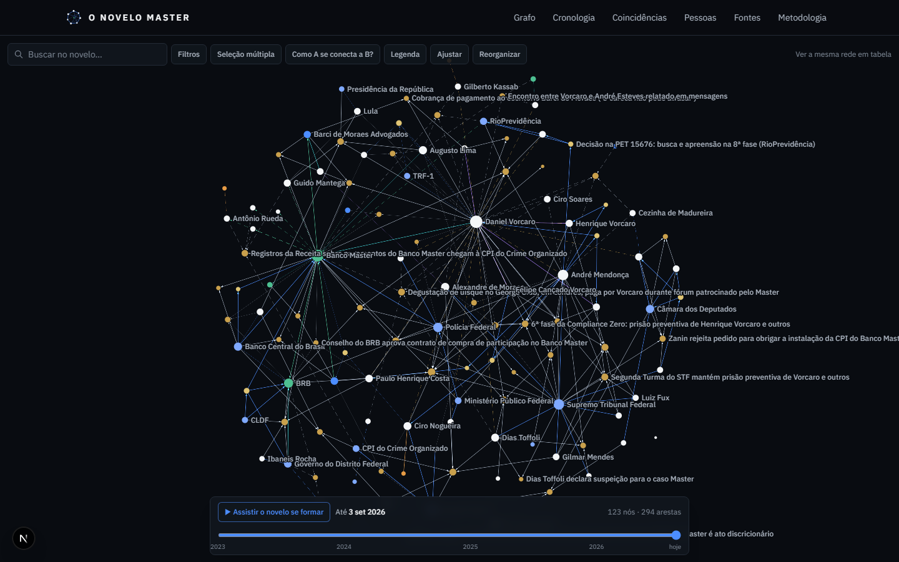

# O Novelo Master

**Mapa público de relações, fatos e fontes** sobre o caso Banco Master, Daniel Vorcaro e os agentes,
empresas, instituições, eventos, contratos, atos públicos e documentos que integram o corpus da
investigação.

> Mostre a evidência. Mostre a conexão. Mostre a cronologia. Deixe a conclusão para o visitante.

Estar neste mapa não implica ilicitude. Cada relação aponta para a fonte que a sustenta e para a força
da evidência correspondente. Alegações e inferências nunca são apresentadas como fatos.



Dataset sintético de estresse e demonstração: `docs/screenshots/grafo-demo.png`.

## O que o site oferece

- **Grafo interativo** (Sigma.js/WebGL): zoom, busca instantânea, seleção múltipla, vizinhança em 1º a 3º
  grau, caminho mínimo ("como A se conecta a B?"), filtros por tipo de nó e de relação, time machine
  ("assistir o novelo se formar"), modo antes/depois de um evento.
- **Dois modos ostensivos**: *Mostrar apenas fontes oficiais* e *Mostrar somente fatos documentados*.
- **Cor = natureza da relação; forma = força da evidência** (documental, corroborado, alegação, inferência).
- **Páginas individuais indexáveis** para pessoas, organizações, eventos, documentos, fontes e atos
  públicos, com "Por que está no Novelo?", linha do tempo, evidências, **posição do citado** e lacunas.
- **Cronologia global**, **coincidências temporais** (proximidade ≠ causalidade), **auditoria de fontes**,
  **histórico de atualizações** e **metodologia** publicada.
- **Lugares geolocalizados** em eventos e organizações, com minimapa estático servido pela própria
  origem (tiles do OpenStreetMap compostos no repositório) e exportação em KML.
- **Acervo em texto** (`/acervo.txt`) e `llms.txt`: o corpus inteiro num arquivo, com classe de
  evidência e fonte por registro, para quem quiser ler o caso com ajuda de um assistente. A página
  `/perguntar` entrega o prompt pronto, com as travas da metodologia.
- **Tema claro e escuro** (automático, claro ou escuro), com contraste WCAG AA testado nas duas paletas.
- **Alternativa textual** ao grafo (`/rede`) e acessibilidade WCAG AA.

## Stack

TypeScript · Next.js 16 (App Router, exportação estática) · React 19 · Tailwind CSS 4 · Sigma.js 3 ·
Graphology · Zod · YAML · Vitest · React Testing Library · Playwright · ESLint · Prettier · gitleaks ·
GitHub Actions · Python (utilitários de OSINT).

## Quick start

```bash
git clone https://github.com/rfausel-lgtm/novelo_master.git novelo-master
cd novelo-master
npm install
git config core.hooksPath .githooks   # pre-commit com gitleaks
npm run dev                            # compila /data e sobe http://localhost:3000
```

Build de produção:

```bash
npm run build      # gera out/ (site estático)
npm run start      # serve out/ em http://localhost:3000
```

## Estrutura

```
data/            corpus editorial em YAML (fonte de verdade; um registro por arquivo)
raw/             material bruto de pesquisa e relatórios dos investigadores
public/mapas/    minimapas estáticos dos lugares (um PNG por registro)
scripts/         pipeline: validação, lint editorial, grafo e layout, acervo em texto, KML, dataset sintético
src/lib/schema   schemas Zod (contrato único do modelo de dados)
src/lib/graph    engine do grafo (algoritmos, filtros, estilos, programas WebGL)
src/components   componentes do grafo e das páginas
src/app          rotas do site
python/          utilitários de captura para OSINT
docs/adr         decisões arquiteturais
tests/           testes unitários e E2E
```

Detalhes em [ARCHITECTURE.md](ARCHITECTURE.md).

## Dataset

Os dados vivem em `data/` e são compilados pelo pipeline:

```bash
npm run data:validate   # schema + referências + regras editoriais (erros bloqueiam)
npm run data:lint       # modo estrito: avisos em registros publicados também bloqueiam
npm run data:build      # gera src/generated/corpus.json, public/data/graph.json, a camada probatória,
                        # public/data/novelo.kml, public/acervo.txt e public/llms.txt
npm run data:stress     # dataset sintético de 5.000 nós / 25.000 arestas para teste de carga
```

O modelo está documentado em [DATA_SCHEMA.md](DATA_SCHEMA.md). A classificação de evidência
(D documental direto, C corroborado, A alegação, I inferência) e os critérios de inclusão estão em
[METHODOLOGY.md](METHODOLOGY.md).

## Testes

```bash
npm run check       # typecheck + lint + validação de dados + testes unitários
npm test            # Vitest
npm run test:e2e    # Playwright (requer build prévio)
```

## Desenvolvimento

- `npm run dev` recompila o corpus e sobe o servidor de desenvolvimento.
- `python python/novelo_osint/minimapas.py` gera os minimapas dos lugares novos (pula os existentes).
- `/grafo?dataset=demo` e `/grafo?dataset=stress` carregam os datasets sintéticos (nomes fictícios).
- Convenções de branch e commit em [CONTRIBUTING.md](CONTRIBUTING.md).

## Contribuição

Contribuições de documentos, correções, novas relações e fontes são bem-vindas por pull request.
Todo PR de dados exige fonte, data, classificação de evidência e explicação, e passa pelo gauntlet
editorial descrito em [EDITORIAL_POLICY.md](EDITORIAL_POLICY.md). Diretrizes de pesquisa em
[OSINT_GUIDELINES.md](OSINT_GUIDELINES.md). Nunca envie segredos por issue ou PR.

## Metodologia

Publicada em `/metodologia` e em [METHODOLOGY.md](METHODOLOGY.md): critérios de inclusão, fontes
aceitas, como relações são criadas, diferença entre fato, alegação e inferência, direito de resposta,
política de correção, versionamento, uso de IA e limitações. Nenhuma afirmação produzida por IA é
evidência; toda informação publicada aponta para fonte verificável.

## Segurança

O repositório é público e não contém segredos: `.env.example` versionado, `.env*` ignorado, gitleaks no
pre-commit e no CI, scanner de fallback, auditoria de dependências, CodeQL e cabeçalhos de segurança no
host. Política de divulgação em [SECURITY.md](SECURITY.md); implantação em [DEPLOYMENT.md](DEPLOYMENT.md).

## Licença

Código sob licença MIT. Os dados do corpus apontam para fontes públicas; cada registro traz a origem.
